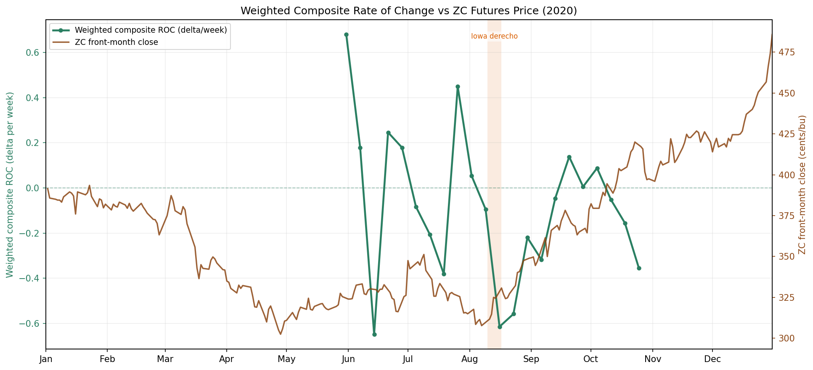
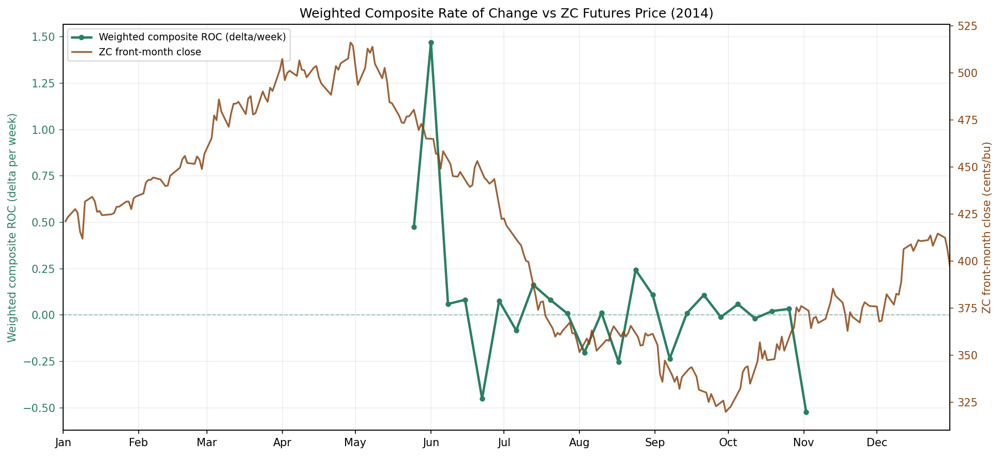
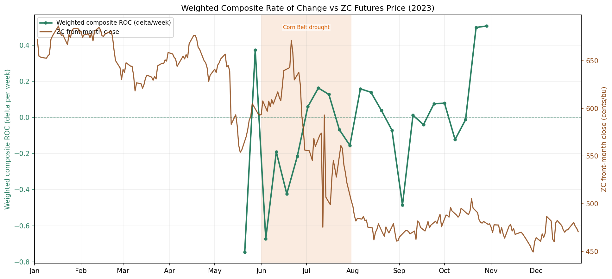

# Can USDA Crop-Condition Shocks Predict Short-Term Corn Futures Returns?

This research note tests whether sudden deterioration in USDA corn crop-condition data has historically preceded short-term upside in front-month corn futures.

The core finding is a September-specific event pattern: when a production-weighted crop-condition surprise deteriorated sharply, ZC corn futures tended to rise over the next five trading sessions.

This is not presented as production-ready alpha. It is a research signal with a plausible economic mechanism, clean implementation checks, and meaningful limitations.

## Headline Result

Strategy:

```text
Signal: ROC shock <= -0.10
Calendar filter: September only
Entry: next Tuesday 08:00 CT day-session open proxy after USDA Crop Progress release
Exit: 5 trading-session opens later
Market: adjusted front-month CBOT corn futures
Sample: 2013-2025 signal years, based on 2012-2025 available testing window
```

Performance:

| Metric | Value |
|---|---:|
| Trades | 23 |
| Wins / Losses | 19 / 4 |
| Mean 5d return | 1.42% |
| Median 5d return | 1.12% |
| Hit rate | 82.6% |
| t-stat | 2.78 |
| Profit factor | 5.03 |
| Exact binomial p-value | 0.0026 |
| Compounded return across trades | 37.3% |

Source table: [sep_roc_strategy_summary.csv](assets/tables/sep_roc_strategy_summary.csv)

## Economic Intuition

USDA Crop Progress reports are public, weekly, and widely watched. The hypothesis is not that crop-condition data is unknown. The hypothesis is that a sharp late-season deterioration can force a short-term repricing of yield risk, especially in September when market attention shifts from growing-season potential to harvestable supply.

The signal is deliberately simple:

```text
ROC shock = change in composite surprise from last week to this week
```

A negative ROC shock means the crop-condition surprise got worse quickly.

## Data

Inputs:

| Dataset | Use |
|---|---|
| USDA NASS weekly Crop Progress / Condition | State-level corn condition scores |
| USDA NASS state production shares | Production-weighted composite |
| Databento ZC 1-hour OHLCV | Adjusted front-month futures returns |

The six modeled states are Iowa, Illinois, Nebraska, Minnesota, Indiana, and South Dakota.

State weights used in code:

| State | Weight |
|---|---:|
| Iowa | 27.09% |
| Illinois | 23.66% |
| Nebraska | 17.28% |
| Minnesota | 14.40% |
| Indiana | 11.10% |
| South Dakota | 6.47% |

## Composite Construction

Each state receives a weekly condition score:

```text
base_ratio = (Good + Excellent) / (Poor + Fair)
```

From September onward, the code applies a harvest-period compression:

```text
harvest_modifier = exp(-(Poor / Good))
composite_c = clip(base_ratio * harvest_modifier, 1, 10)
```

The six state scores are combined using production weights:

```text
weighted_composite = sum(state_score * production_weight) / available_weight
```

The `available_weight` adjustment prevents missing state rows from being treated as zero.

## Surprise And ROC Shock

For each crop week, the code builds a two-year seasonal expectation:

```text
expected_composite_2y = average of the same crop week in year-1 and year-2
```

Then:

```text
composite_surprise = weighted_composite - expected_composite_2y
ROC shock = composite_surprise[t] - composite_surprise[t-1]
```

The ROC calculation is grouped by calendar year, so the first print of a new season is not compared with the previous year.

## Futures Rolling And Execution

The futures return series uses a volume-led, ratio-adjusted front-month chain:

| Step | Treatment |
|---|---|
| Contract selection | Prior-session volume leadership |
| Roll direction | Forward-only by expiry proxy |
| Roll adjustment | Ratio-adjust OHLC across contract switches |
| Entry price | 08:00 CT 1-hour bar open, proxy for the 08:30 CT day-session open |
| Exit price | Same open proxy, 5 trading sessions later |

This is intended to avoid artificial roll jumps and avoid daily-close entry ambiguity.

## Chart Examples

The 2020 example is the cleanest visual: crop-condition ROC deteriorates sharply and futures rally afterward.



2014 is useful as a modest/near-flat signal year.



2023 is useful as a mixed recent year.



Additional chart assets:

| Year | Chart |
|---|---|
| 2015 | [roc_vs_futures_2015.png](assets/charts/roc_vs_futures_2015.png) |
| 2016 | [roc_vs_futures_2016.png](assets/charts/roc_vs_futures_2016.png) |
| 2022 | [roc_vs_futures_2022.png](assets/charts/roc_vs_futures_2022.png) |
| 2025 | [roc_vs_futures_2025.png](assets/charts/roc_vs_futures_2025.png) |

## Baseline Comparisons

The signal is not simply long crop-season corn exposure.

| Benchmark | Trades | Mean | Hit rate | t-stat | Profit factor |
|---|---:|---:|---:|---:|---:|
| ROC shock strategy | 23 | 1.42% | 82.6% | 2.78 | 5.03 |
| All September session-open days, rolling 5d | 285 | 0.25% | 51.9% | 1.70 | 1.29 |
| September monthly buy-and-hold | 14 | -0.52% | 71.4% | -0.40 | 0.74 |
| Monthly rolling Jun-Oct long | 70 | -0.86% | 44.3% | -0.90 | 0.75 |

Source table: [benchmark_summary.csv](assets/tables/benchmark_summary.csv)

## September Deep Dive

A separate deep dive tests whether the effect is simply generic September strength. It compares signal weeks against all September crop-report weeks, non-signal September weeks, rolling September 5-day entries, September buy-and-hold, and randomized September week selections.

Deep dive: [september_effect_deep_dive.md](september_deep_dive/september_effect_deep_dive.md)

## Threshold Sensitivity

September-only threshold behavior is orderly rather than concentrated in one isolated cutoff.

Selected 5-day rows:

| ROC threshold | Trades | Years | Mean 5d return | Hit rate | t-stat |
|---|---:|---:|---:|---:|---:|
| -0.30 | 4 | 3 | 3.20% | 100.0% | 5.08 |
| -0.25 | 6 | 5 | 3.28% | 100.0% | 4.01 |
| -0.20 | 9 | 5 | 2.40% | 88.9% | 3.31 |
| -0.15 | 15 | 10 | 1.37% | 86.7% | 2.06 |
| -0.10 | 23 | 13 | 1.42% | 82.6% | 2.78 |
| -0.05 | 26 | 13 | 1.50% | 80.8% | 3.19 |

Source table: [sep_only_threshold_horizon_sweep.csv](assets/tables/sep_only_threshold_horizon_sweep.csv)

Interpretation: stricter thresholds produce fewer, larger signals; looser thresholds add sample while gradually diluting quality. That shape is more encouraging than a single parameter spike.

## By-Year Breakdown

| Year | Trades | Mean 5d return | Hit rate | Signal dates |
|---|---:|---:|---:|---|
| 2013 | 2 | -2.16% | 50.0% | 2013-09-01, 2013-09-08 |
| 2014 | 1 | 0.14% | 100.0% | 2014-09-07 |
| 2015 | 2 | 4.04% | 100.0% | 2015-09-06, 2015-09-20 |
| 2016 | 2 | 3.97% | 100.0% | 2016-09-04, 2016-09-25 |
| 2017 | 1 | 0.07% | 100.0% | 2017-09-17 |
| 2018 | 1 | 0.76% | 100.0% | 2018-09-02 |
| 2019 | 3 | 2.39% | 100.0% | 2019-09-08, 2019-09-22, 2019-09-29 |
| 2020 | 2 | 4.09% | 100.0% | 2020-09-06, 2020-09-27 |
| 2021 | 1 | -1.15% | 0.0% | 2021-09-05 |
| 2022 | 2 | 0.08% | 50.0% | 2022-09-18, 2022-09-25 |
| 2023 | 2 | 1.40% | 100.0% | 2023-09-03, 2023-09-17 |
| 2024 | 1 | 1.12% | 100.0% | 2024-09-01 |
| 2025 | 3 | 0.54% | 66.7% | 2025-09-07, 2025-09-21, 2025-09-28 |

Source table: [sep_roc_strategy_by_year.csv](assets/tables/sep_roc_strategy_by_year.csv)

## Execution Cost Stress

The strategy was stressed with round-trip return haircuts.

| Cost assumption | Mean return | Hit rate | t-stat | Profit factor |
|---|---:|---:|---:|---:|
| No cost | 1.42% | 82.6% | 2.78 | 5.03 |
| 5 bps round-trip | 1.37% | 82.6% | 2.69 | 4.79 |
| 10 bps round-trip | 1.32% | 78.3% | 2.59 | 4.55 |
| 20 bps round-trip | 1.22% | 69.6% | 2.39 | 4.06 |
| 50 bps round-trip | 0.92% | 69.6% | 1.80 | 2.87 |
| 100 bps round-trip | 0.42% | 52.2% | 0.82 | 1.60 |

Source table: [execution_cost_stress.csv](assets/tables/execution_cost_stress.csv)

## Audit Notes

Checks performed:

| Check | Result |
|---|---|
| Entry after report release | Passed |
| Tuesday 08:00 CT entry proxy | 23/23 September trades |
| Duplicate entries | None |
| Overlapping 5d positions | None |
| Seasonal expectation uses future years | No |
| Adjusted futures chain removes artificial roll jumps | Yes |
| Signal beats September rolling 5d baseline | Yes |

Top-winner stress:

| Test | Mean | Hit rate | t-stat | Profit factor |
|---|---:|---:|---:|---:|
| Full strategy | 1.42% | 82.6% | 2.78 | 5.03 |
| Drop top 1 winner | 1.20% | 81.8% | 2.49 | 4.26 |
| Drop top 2 winners | 1.01% | 81.0% | 2.18 | 3.63 |
| Drop top 3 winners | 0.82% | 80.0% | 1.84 | 3.03 |
| Drop top 5 winners | 0.52% | 77.8% | 1.19 | 2.16 |

The result weakens when large winners are removed, but it does not disappear immediately.

## Limitations

Main limitations:

| Limitation | Why it matters |
|---|---|
| Small sample | 23 trades is not enough for production confidence |
| Calendar specificity | The edge is strongest in September |
| Researcher degrees of freedom | Threshold and horizon were explored |
| No live validation | Historical result only |
| One-market test | Needs cross-crop or spread validation |

## Next Tests

The most useful extensions:

1. Paper trade the rule live during upcoming Crop Progress seasons.
2. Test adjacent crops such as soybeans and wheat.
3. Test calendar spreads instead of outright ZC.
4. Add weather, drought monitor, and regional precipitation features.
5. Run a formal walk-forward design with thresholds selected only on prior data.

## Bottom Line

This research found a historically strong September reaction pattern in corn futures after sudden crop-condition deterioration. The result survives implementation checks and simple cost stress, and it meaningfully outperforms same-market seasonal baselines.

I would treat it as a promising commodity research signal, not a finished trading system.
